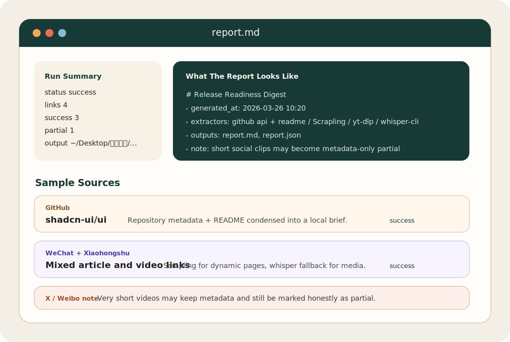

# OpenClaw Content Processor

> Turn share links into Obsidian-friendly local notes and briefing reports.

English | [简体中文](./README.zh-CN.md)

[](https://github.com/jjjojoj/openclaw-content-processor/actions/workflows/ci.yml)
[](./LICENSE)

`openclaw-content-processor` is an OpenClaw skill and standalone CLI tool that takes one or more share links, extracts the useful content, and saves them as local Markdown + JSON outputs. It can now write directly into an Obsidian vault as knowledge-card notes by default, with the legacy digest layout still available when needed.



## Workspace Update

- The current workspace build defaults to `knowledge-card` output in Obsidian mode.
- `.env` files inside the skill directory are loaded automatically, so local OpenAI-compatible settings can take effect without manual export.
- Non-OpenAI providers such as GLM / MiniMax can now use `chat/completions` style endpoints, while official OpenAI still uses `responses`.
- If you already configured `zai` / GLM Coding Plan inside OpenClaw, this skill can now reuse that local provider config instead of maintaining a second key by hand.
- GitHub repositories now generate repository-specific knowledge cards and are automatically linked into `MOC/GitHub` category branches such as `AI Agent`, `SaaS`, and `FastAPI`.

## What's New In v2.4.0

- Obsidian export is now a first-class output mode, with YAML frontmatter and one note per source.
- Douyin handling is more resilient: saved auth -> QR-login retry -> Playwright network interception fallback.
- Temporary mp4 files used only for transcription are deleted automatically after the transcript is produced.
- Feishu / Feishu Wiki upload is not supported in the current release. The supported output targets are local desktop reports and Obsidian vaults.

## Install In OpenClaw

If you want OpenClaw to install and bootstrap this skill for you, copy this prompt:

```text
Install this OpenClaw skill from GitHub and make it ready to use:
https://github.com/jjjojoj/openclaw-content-processor.git

After installing:
1. Run the required bootstrap/setup steps.
2. Check whether dependencies such as ffmpeg and whisper-cli are available.
3. If I use Obsidian, tell me how to configure the vault path and the exact command I can run right away.
```

If the skill list does not refresh immediately, restart OpenClaw once.

It is designed for:

- GitHub repositories
- regular article pages
- dynamic pages such as WeChat / Zhihu / CSDN / Toutiao
- video and social links such as Bilibili, Xiaohongshu, Weibo, X/Twitter, Douyin, and YouTube

## Why This Exists

Most link summarizers either stay inside chat or only handle one platform well. This project is opinionated in a different way:

- local-first: always write notes to disk first, with Obsidian as a first-class target
- local-only outputs: Feishu / Wiki upload is intentionally out of scope in the current release
- multi-source: accept one or many links in one run
- layered fallback: use different extractors for GitHub, static web, dynamic pages, and media
- automation-friendly: emit both Markdown and structured JSON

## Validated Status

Current stable release: `v2.4.0`

Stable-release validation last refreshed on `2026-04-19`:

| Platform | Status | Notes |
| --- | --- | --- |
| GitHub | Stable | Uses GitHub API + README extraction |
| Generic web pages | Stable | Main path uses `trafilatura` |
| WeChat | Stable | Usually succeeds via `Scrapling` |
| Zhihu / CSDN | Stable | Real links verified |
| Toutiao | Usually works | Depends on page structure and anti-bot behavior |
| Bilibili | Usually works | Subtitles first, then `whisper-cli` fallback |
| Xiaohongshu | Usually works | May need media transcription |
| X/Twitter | Mixed | Public video posts can work, but quality depends on transcription |
| Weibo | Mixed | Short noisy videos may become `metadata-only partial` |
| Douyin | Usually works | Order is “saved auth -> QR login retry -> Playwright download fallback” |
| YouTube | Supported | Public videos usually work without extra auth |

## Release Validation

The current stable release is backed by two validation layers:

- installation validation: `bash scripts/bootstrap.sh --install-python`, `bash scripts/bootstrap.sh`, `.venv/bin/python -m py_compile ...`, and `.venv/bin/python -m unittest discover -s tests -v`
- live-link validation: public GitHub, Zhihu, CSDN, Toutiao, and Bilibili samples were rechecked on `2026-04-19`; representative WeChat, Xiaohongshu, X/Twitter, Weibo, and Douyin flows remain documented in the release validation notes

See [docs/release-validation.md](./docs/release-validation.md) for the latest release checklist, command set, and platform notes.

## Features

| Capability | What it does |
| --- | --- |
| GitHub extractor | Pulls repo metadata, topics, stars, default branch, and README |
| Web extractor | Uses `trafilatura` for article-style pages |
| Dynamic-page fallback | Uses `Scrapling` for harder pages |
| Media pipeline | Uses `yt-dlp` subtitles first, then `ffmpeg + whisper-cli` |
| Local analysis | Produces summary, highlights, keywords, and analysis text |
| Structured output | Saves `report.md`, `report.json`, and per-item JSON files |
| Obsidian export | Writes vault-ready knowledge-card notes by default, with a legacy digest layout available |
| GitHub knowledge branch | Adds `MOC/GitHub` hub notes and category links for GitHub cards inside Obsidian |
| Batch-safe execution | One bad source does not kill the whole run |

## Quick Start

### 1. Install system dependencies

macOS:

```bash
brew install ffmpeg whisper-cpp
```

### 2. Install local Python runtime

```bash
bash scripts/bootstrap.sh --install-python
```

This installs the skill-local runtime into `.venv/`, including:

- `yt-dlp`
- `trafilatura`
- `Scrapling`

### 2.5. Reuse OpenClaw's GLM config (optional, recommended)

If OpenClaw already has a working `zai` / GLM Coding Plan setup, enable this in the skill `.env`:

```env
CONTENT_PROCESSOR_USE_OPENCLAW_ZAI=1
CONTENT_PROCESSOR_OPENCLAW_MODEL_REF=zai/glm-4.7
```

When enabled, the skill reads the local `zai` provider from `~/.openclaw/openclaw.json` and reuses that Coding Plan setup. The default coding-plan analysis model is `glm-4.7`. Flash models are no longer the recommended default for coding-plan analysis.

### 3. Run it

Desktop / local report mode:

```bash
bash scripts/run.sh "https://github.com/openai/openai-python"
```

Obsidian mode:

```bash
bash scripts/run.sh \
  --knowledge-card \
  --vault "$HOME/Documents/MyVault" \
  --folder "Inbox/内容摘要" \
  "https://github.com/openai/openai-python"
```

Or let it also check system dependencies:

```bash
bash scripts/run.sh --auto-bootstrap "https://github.com/openai/openai-python"
```

## Usage

### Basic CLI

```bash
bash scripts/run.sh \
  "https://github.com/openai/openai-python" \
  "https://mp.weixin.qq.com/s/xxxxxxxx"
```

### Explicit title and sources

```bash
bash scripts/run.sh \
  --title "Today's Link Briefing" \
  --source "https://x.com/..." \
  --source "https://video.weibo.com/show?fid=..."
```

### Obsidian-first workflow

```bash
bash scripts/run.sh \
  --obsidian \
  --vault "$HOME/Documents/MyVault" \
  --folder "Inbox/内容摘要" \
  --title "AI Links Inbox" \
  --source "https://github.com/openai/openai-python" \
  --source "https://mp.weixin.qq.com/s/xxxxxxxx"
```

### With browser session / cookies

```bash
bash scripts/run.sh \
  --cookies-from-browser chrome \
  --referer "https://mp.weixin.qq.com/" \
  --source "https://mp.weixin.qq.com/s/xxxxxxxx"
```

### Douyin QR login

```bash
bash scripts/run.sh --login-douyin
```

After a successful scan, the skill saves the auth state under `auth/douyin/` and reuses it automatically for future Douyin links. If you only want to verify that the real media URL is resolvable first, run:

```bash
bash scripts/run.sh --resolve-douyin-url "https://v.douyin.com/xxxxxxxx/"
```

If you run on a self-hosted runner, VNC session, or remote desktop where a human can actually scan the QR code, you can explicitly allow QR login without a TTY:

```bash
CONTENT_PROCESSOR_ALLOW_NON_TTY_DOUYIN_LOGIN=1 \
bash scripts/run.sh --login-douyin
```

### Use OpenClaw's GLM provider for analysis

```bash
CONTENT_PROCESSOR_USE_OPENCLAW_ZAI=1 \
bash scripts/run.sh \
  --analysis-mode llm \
  "https://github.com/openai/openai-python"
```

The Douyin media path now follows this order:

- try saved cookies / auth first
- if auth is still required, trigger one QR-login retry
- if that still does not work, fall back to Playwright network interception

Temporary mp4 files downloaded only for transcription are deleted automatically after transcription finishes, so they do not accumulate in the final report output.

### Lightweight regression

```bash
python scripts/run_regression.py --preset core
```

## Output

Default desktop output root:

```text
~/Desktop/内容摘要/YYYY-MM-DD/<timestamp>/
```

Desktop mode produces:

```text
report.md
report.json
items/
  source-1.json
  source-2.json
```

Obsidian mode produces:

```text
<Vault>/<Folder>/
  _index.md
  _log.md
  YYYY-MM-DD/
    <timestamp_title>/
      Agent boundary control.md
      report.json
      items/
        01_title.json
```

The default Obsidian note set includes:

- one knowledge-card markdown note per source/link
- YAML frontmatter for Dataview / filtering / tagging
- `_index.md` and `_log.md` append-only navigation files at the vault-folder root
- GitHub cards automatically link into `MOC/GitHub` and category pages such as `AI Agent`, `SaaS`, `FastAPI`, or `Automation`
- no `sources/` directory in the default knowledge-card layout

If you still need the older batch digest + per-source layout, run:

```bash
bash scripts/run.sh --digest --vault "$HOME/Documents/MyVault" "https://example.com"
```

`report.json` includes:

- overall run status
- counts for success / partial / failed items
- tool and analysis metadata
- per-item summaries, warnings, extract methods, and content stats

Typical CLI response:

```json
{
  "schema_version": "1.0.0",
  "status": "success",
  "report_title": "GitHub validation",
  "output_dir": "/Users/you/Documents/MyVault/Inbox/内容摘要/2026-04-20/20260420_194000_GitHub验证",
  "report_md": "/Users/you/Documents/MyVault/Inbox/内容摘要/2026-04-20/20260420_194000_GitHub验证/OpenAI Python SDK.md",
  report.json
  items/
    01_title.json
```

## Extraction Strategy

Different sources use different pipelines on purpose:

- GitHub repositories: `GitHub API + README`
- Regular web pages: `trafilatura`
- Dynamic / anti-bot pages: `Scrapling`
- Media links: `yt-dlp` subtitles first
- No usable subtitles: `ffmpeg + whisper-cli`
- Analysis layer: official OpenAI uses `responses`; non-OpenAI-compatible providers default to `chat/completions`; local heuristic remains the final fallback

## Configuration

See [.env.example](./.env.example) for the full list.

Most useful variables:

- `OPENAI_API_KEY`
- `OPENAI_BASE_URL`
- `CONTENT_PROCESSOR_OPENAI_RESPONSES_URL`
- `CONTENT_PROCESSOR_ANALYSIS_MODE`
- `CONTENT_PROCESSOR_ANALYSIS_MODEL`
- `CONTENT_PROCESSOR_OUTPUT_MODE`
- `CONTENT_PROCESSOR_OBSIDIAN_VAULT`
- `CONTENT_PROCESSOR_OBSIDIAN_FOLDER`
- `CONTENT_PROCESSOR_OBSIDIAN_LAYOUT`
- `CONTENT_PROCESSOR_COOKIES_FILE`
- `CONTENT_PROCESSOR_COOKIES_FROM_BROWSER`
- `CONTENT_PROCESSOR_COOKIE_HEADER`
- `CONTENT_PROCESSOR_REFERER`
- `WHISPER_MODEL`

## OpenClaw Integration

This repository contains both human-facing and OpenClaw-facing files:

- [README.md](./README.md): human documentation
- [SKILL.md](./SKILL.md): OpenClaw skill instructions
- [agents/openai.yaml](./agents/openai.yaml): UI metadata for OpenClaw skill lists and default prompts

If you only want the CLI workflow, `agents/openai.yaml` is not required.

## Repository Layout

```text
.
├── assets/
│   └── report-preview.svg
├── docs/
│   ├── release-validation.md
│   └── release-validation.zh-CN.md
├── README.md
├── README.zh-CN.md
├── CHANGELOG.md
├── LICENSE
├── SKILL.md
├── .env.example
├── .github/workflows/ci.yml
├── agents/openai.yaml
├── scripts/
│   ├── bootstrap.sh
│   ├── run.sh
│   ├── process_share_links.py
│   └── run_regression.py
└── tests/
    └── test_process_share_links.py
```

## Development

Run local checks:

```bash
python3 -m py_compile scripts/process_share_links.py scripts/run_regression.py
python3 -m unittest discover -s tests -v
python3 scripts/run_regression.py --preset github
```

GitHub Actions runs:

- local runtime bootstrap
- Python compile checks
- unit tests

Public CI does not run all live platform regressions, and it does not attempt real Douyin QR login.

Recommended testing split:

- public CI: compile checks, unit tests, lightweight public-link regression, and mocked Douyin auth gating
- self-hosted runner / desktop smoke test: real Douyin QR login, cookie reuse, and Playwright fallback verification

## Limitations

- The slowest path is media transcription; some runs can take minutes
- Some platforms need cookies, browser sessions, or referers to be reliable
- Very short or mostly-music videos may only produce `metadata-only partial`
- Anti-bot behavior can change over time, especially on social platforms

## Contributing

See [CONTRIBUTING.md](./CONTRIBUTING.md).

## License

MIT. See [LICENSE](./LICENSE).
