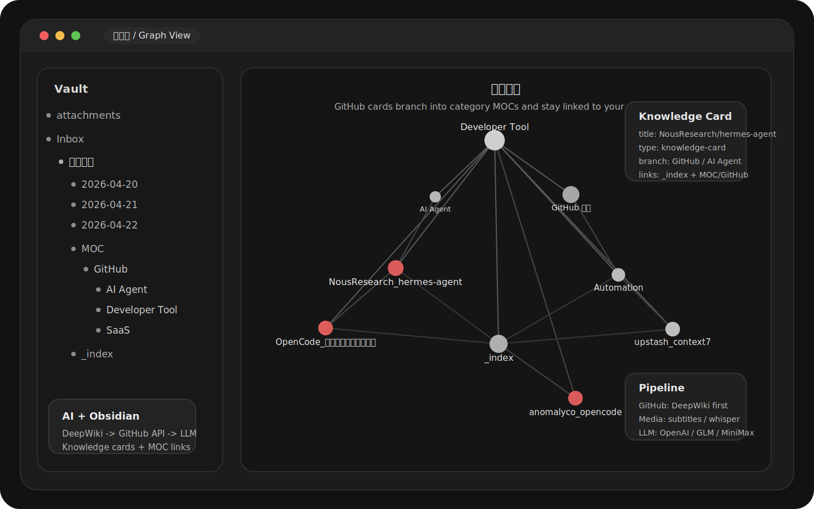

# OpenClaw Content Processor

> AI-powered link ingestion for OpenClaw and Obsidian. Turn GitHub repos, articles, and short videos into linked knowledge cards inside your vault.

English | [简体中文](./README.zh-CN.md)

[](https://github.com/jjjojoj/openclaw-content-processor/actions/workflows/ci.yml)
[](./LICENSE)

`openclaw-content-processor` is both an OpenClaw skill and a standalone CLI tool. Its main job is no longer "make a quick summary in chat"; it is "capture the source, run AI analysis, and write a reusable note into Obsidian." Desktop reports still exist as a compatibility path, but the product direction is clearly AI + Obsidian.



## Why this repo feels different

- Obsidian-first: one source becomes one reusable knowledge card, not a disposable chat reply
- GitHub-first workflow: repositories go through a dedicated path and are linked into `MOC/GitHub`
- AI analysis on top of extraction: OpenAI `responses` or OpenAI-compatible `chat/completions`
- layered extraction: DeepWiki / GitHub API / README / `trafilatura` / `Scrapling` / `yt-dlp` / `whisper-cli` / Playwright
- local output only: Feishu / Feishu Wiki upload is explicitly out of scope

## Main branch snapshot

Latest stable tag: `v2.4.0`

Current `main` already includes additional improvements that are not part of the `v2.4.0` tag yet:

- GitHub cards now use a DeepWiki-first flow, with GitHub API + README as the fallback / evidence path
- GitHub notes are written as student-friendly "how to learn this repo" cards
- short-video cards now keep cleaner titles, cleaner authors, and better structured bullets
- `.env` inside the skill directory loads automatically
- latest local verification on `2026-04-22`: `py_compile` passed, `67` tests passed

## Install in OpenClaw

If you want OpenClaw to install and bootstrap this skill for you, copy this prompt:

```text
Install this OpenClaw skill from GitHub and make it ready to use:
https://github.com/jjjojoj/openclaw-content-processor.git

After installing:
1. Run the required bootstrap/setup steps.
2. Check whether dependencies such as ffmpeg and whisper-cli are available.
3. If I use Obsidian, configure my vault path and tell me the exact command I can run right away.
4. If OpenClaw can reuse my local GLM / z.ai provider config, enable that too.
```

If the skill list does not refresh immediately, restart OpenClaw once.

## What it handles

- GitHub repositories
- regular article pages
- dynamic pages such as WeChat / Zhihu / CSDN / Toutiao
- social and video links such as Douyin, Bilibili, Xiaohongshu, Weibo, X/Twitter, and YouTube
- local-first note delivery into Obsidian, with desktop output kept only as fallback / compatibility

## Pipeline

### 1. Source ingestion

Pass one or more links in one run. The tool keeps source order and processes them as one batch.

### 2. Extraction

- GitHub: `DeepWiki overview -> GitHub API metadata -> README / headings`
- articles: `trafilatura`
- harder dynamic pages: `Scrapling`
- media: subtitles first, then `ffmpeg + whisper-cli`
- Douyin: `saved auth -> QR login retry -> Playwright download fallback`

### 3. Analysis

- official OpenAI: `responses`
- GLM / MiniMax / compatible providers: `chat/completions`
- OpenClaw local `zai` provider can be reused instead of maintaining a second key

### 4. Delivery

- recommended: Obsidian knowledge-card notes
- legacy fallback: desktop `report.md` / `report.json`
- structured metadata is always kept in sibling `*.report.json`

## Quick start

### 1. Install system dependencies

macOS:

```bash
brew install ffmpeg whisper-cpp
```

### 2. Install the local Python runtime

```bash
bash scripts/bootstrap.sh --install-python
```

This installs the skill-local runtime into `.venv/`, including:

- `yt-dlp`
- `trafilatura`
- `Scrapling`

### 3. Configure Obsidian output

The cleanest setup is to put the vault path in `.env`:

```env
CONTENT_PROCESSOR_OUTPUT_MODE=obsidian
CONTENT_PROCESSOR_OBSIDIAN_VAULT=/absolute/path/to/your/vault
CONTENT_PROCESSOR_OBSIDIAN_FOLDER=Inbox/内容摘要
CONTENT_PROCESSOR_OBSIDIAN_LAYOUT=knowledge-card
```

If OpenClaw already has a working GLM Coding Plan setup, you can also reuse it:

```env
CONTENT_PROCESSOR_USE_OPENCLAW_ZAI=1
CONTENT_PROCESSOR_OPENCLAW_MODEL_REF=zai/glm-4.7
```

See [`.env.example`](./.env.example) for the full set of options.

### 4. Run it

Recommended GitHub example:

```bash
bash scripts/run.sh "https://github.com/NousResearch/hermes-agent"
```

Explicit Obsidian mode:

```bash
bash scripts/run.sh \
  --knowledge-card \
  --vault "$HOME/Documents/MyVault" \
  --folder "Inbox/内容摘要" \
  "https://github.com/NousResearch/hermes-agent"
```

Or let it verify local dependencies on the same run:

```bash
bash scripts/run.sh --auto-bootstrap "https://github.com/NousResearch/hermes-agent"
```

## Usage examples

### GitHub + article

```bash
bash scripts/run.sh \
  --title "AI Reading Inbox" \
  --source "https://github.com/NousResearch/hermes-agent" \
  --source "https://mp.weixin.qq.com/s/xxxxxxxx"
```

### Obsidian-first workflow

```bash
bash scripts/run.sh \
  --obsidian \
  --vault "$HOME/Documents/MyVault" \
  --folder "Inbox/内容摘要" \
  --title "Today's Knowledge Inbox" \
  --source "https://github.com/anomalyco/opencode" \
  --source "https://v.douyin.com/xxxxxxxx/"
```

### With browser session / cookies

```bash
bash scripts/run.sh \
  --cookies-from-browser chrome \
  --referer "https://mp.weixin.qq.com/" \
  --source "https://mp.weixin.qq.com/s/xxxxxxxx"
```

### Douyin QR login

```bash
bash scripts/run.sh --login-douyin
```

After a successful scan, the skill saves auth under `auth/douyin/` and reuses it automatically for later Douyin links. If you only want to verify the real media URL first:

```bash
bash scripts/run.sh --resolve-douyin-url "https://v.douyin.com/xxxxxxxx/"
```

If you run on a self-hosted runner, VNC session, or remote desktop where a human can actually scan the QR code, you can explicitly allow QR login without a TTY:

```bash
CONTENT_PROCESSOR_ALLOW_NON_TTY_DOUYIN_LOGIN=1 \
bash scripts/run.sh --login-douyin
```

## What gets written into Obsidian

Recommended knowledge-card layout:

```text
<Vault>/Inbox/内容摘要/
  _index.md
  MOC/
    GitHub/
      GitHub 仓库.md
      AI Agent.md
      Developer Tool.md
  YYYY-MM-DD/
    NousResearch_hermes-agent.md
    OpenCode_保姆级配置与实战指南.md
    20260422_205925_OpenCode全攻略.report.json
```

Important details:

- one source -> one markdown knowledge card
- GitHub cards keep the exact repository name as the note title
- GitHub cards are linked into `MOC/GitHub` category branches automatically
- `_index.md` acts as the main inbox entry point
- `_log.md` and per-run `items/` folders are no longer generated

## Example output style

Real cards already generated with the current pipeline include:

- `NousResearch/hermes-agent`: a GitHub learning card with sections like "what problem this repo solves", "how the system is layered", and "which files to read first"
- `OpenCode 保姆级配置与实战指南`: a Douyin-derived card built from `playwright douyin download + whisper-cli`, then rewritten into a practical learning note

This is the intended output style: readable enough for humans, structured enough for Obsidian graph / Dataview workflows, and grounded enough to avoid freeform hallucinated summaries.

## Platform support

Current stable tag: `v2.4.0`

| Platform | Status | Notes |
| --- | --- | --- |
| GitHub | Stable | Current `main` prefers DeepWiki overview first, then uses GitHub API + README as fallback / evidence |
| Generic web pages | Stable | Main path uses `trafilatura` |
| WeChat | Stable | Usually succeeds via `Scrapling` |
| Zhihu / CSDN | Stable | Real links verified |
| Toutiao | Usually works | Depends on page structure and anti-bot behavior |
| Bilibili | Usually works | Subtitles first, then `whisper-cli` fallback |
| Xiaohongshu | Usually works | May need media transcription |
| X/Twitter | Mixed | Public video posts can work, but quality depends on transcription |
| Weibo | Mixed | Short noisy videos may become `metadata-only partial` |
| Douyin | Usually works | Order is `saved auth -> QR login retry -> Playwright download fallback` |
| YouTube | Supported | Public videos usually work without extra auth |

## Validation

The repository homepage is intentionally more honest than marketing-heavy. The current documented state is:

- stable release baseline: `v2.4.0`
- latest `main` verification on `2026-04-22`: `py_compile` passed, `67` tests passed
- representative GitHub run: `deepwiki overview`
- representative Douyin run: `playwright douyin download + whisper-cli`

See [docs/release-validation.md](./docs/release-validation.md) for the stable release checklist, public CI vs self-hosted runner strategy, and current manual regression notes.

## Scope and non-goals

- Obsidian is the primary output target
- desktop output remains only as a compatibility path
- Feishu / Feishu Wiki upload is not supported
- when `--analysis-mode llm` is required and the LLM is unavailable, the run can fail fast instead of silently pretending everything is fine

## License

MIT. See [LICENSE](./LICENSE).
